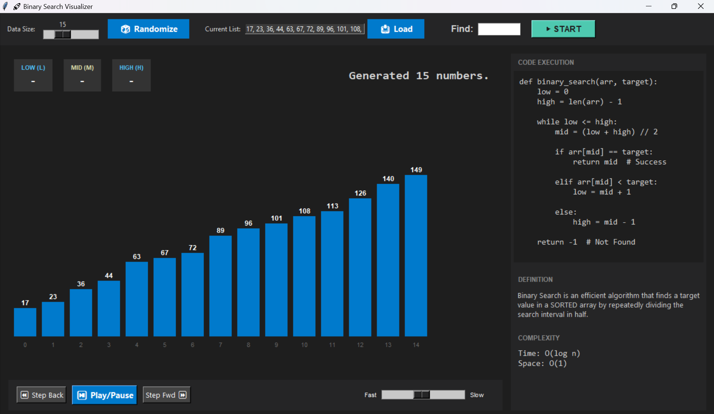

# 🚀 Binary Search Visualizer

A professional, interactive visualization tool that teaches the array-based Binary Search algorithm. Built with **Python 3** and **Tkinter**, the app provides step-by-step execution, a polished UI, and optional audio feedback to make learning intuitive and fun.



## 📌 Features

- **Real-time Visualization:** Animated bars show how Binary Search reduces the array in each step.
- **Step Controls:** Play, Pause, Step Forward, Step Back, and Reset.
- **Speed Control:** Fast ↔ Slow animation slider.
- **Educational Dashboard:** Live LOW / MID / HIGH pointers + pseudocode highlighting.
- **Custom Input:** Load your own sorted list or auto-generate one.
- **Cross-platform Sound Fallback:** Uses `winsound` on Windows; uses Tkinter bell on other OSes.
- **Strict Input Validation:** Prevents unsorted list input for correct Binary Search behavior.
- **Lightweight GUI:** Runs using Python’s built-in Tkinter.

## 🛠 Tech Stack

- **Language:** Python 3.x
- **GUI:** Tkinter (Standard Library)
- **Audio:** winsound (Windows) with auto fallback
- **Platform:** Windows, Linux, macOS (Tkinter support required)

## ✅ Requirements

- Python 3.7+
- Tkinter (usually included with Python)


## 🚀 How to Run

1. **Clone the repository:**
   ```bash
   git clone [https://github.com/divyakjce123/Binary-Search-Visualizer](https://github.com/divyakjce123/Binary-Search-Visualizer)
   cd AlgoViz-Binary-Search
Run the project:


python main.py
(If your system uses python3, try python3 main.py)

# 🧭 How to Use the App
Generate a list: Use 🎲 Randomize or enter a sorted list manually.

Select Target: Enter a number in the Find box (leave empty to auto-pick a random target).

Start: Click ▶ START to begin the visualization.

Controls:

▶ Play

⏸ Pause

⏩ Step Forward

⏪ Step Back

🔁 Reset

Speed: Control animation speed using the Fast ↔ Slow slider.

Observe:

Updated LOW, MID, HIGH values.

Highlighted code lines on the right panel.

Color-coded bars (Blue = Active, Yellow = Mid, Green = Found).

# 🧩 Example Inputs
Valid sorted custom list:

Plaintext

3, 7, 12, 19, 24, 31, 42
Note: Unsorted input will trigger a validation error.

# 📦 Build Windows Executable (Optional)
If you want to turn this into an .exe file:

pip install pyinstaller
pyinstaller --onefile --windowed main.py
The .exe file will appear in the dist/ folder.

# ♿ Cross-platform Notes
Tkinter enables Windows, macOS, and Linux compatibility.

If winsound is unavailable (macOS/Linux), the app automatically switches to a standard system bell.

No features break due to missing sound.

# 🧾 Code Structure
main.py: Contains the core logic.

ProBinarySearchApp: Handles UI and Event logic.

SearchStep: Tracks the timeline state for each algorithm step.

Visual rendering: Logic for drawing bars, arrows, and highlighting code.

# 💡 Future Enhancements
[ ] Add sound ON/OFF toggle.

[ ] Recursive Binary Search visualization mode.

[ ] Export animation as GIF.

[ ] Keyboard shortcuts for controls (Space to pause, Arrows to step).

# 🧪 Validation / Safety
Custom lists must be sorted.

UI remains responsive using root.after() instead of blocking time.sleep().

All sound functions are wrapped in try-catch blocks to prevent crashes on unsupported systems.

# 📄 License
This project uses the MIT License. Feel free to modify and use for educational or academic purposes.

# 🤝 Contributing
Fork the repo.
Create a new branch.
Commit your changes.
Submit a Pull Request.

# 👩‍🏫 Author
Project created by Divya Jadhav
Ideal for mini projects, algorithm demonstrations, and academic submissions.
